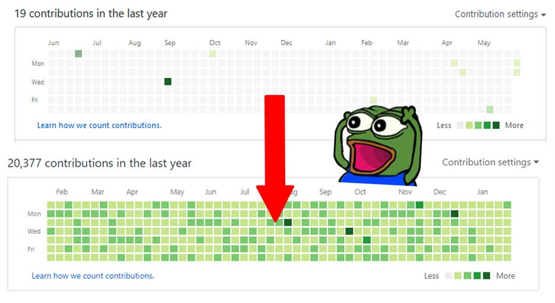
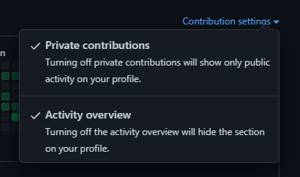
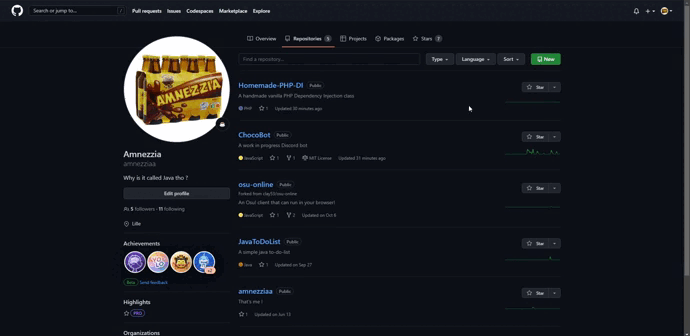

# ContributorJS ✅

> A simple script that will generate contributions for your profile.



## How does it work ?

The idea behind the script is to fill up your Git graph by creating commits back in time. All you have to do is run the script once and wait for the changes to appear on your graph.

### **Privacy settings** :

You can choose to set the created repository Private or Public. **It will not affect your graph display at all.** 

The only thing you will have to do if you want the repository to be `private` is to turn the private contribution setting on.



## Usage guide 🚀 :

### Prerequisites :

You will need to have [NodeJS](https://nodejs.org/en/) and [Git](https://git-scm.com/) installed on your machine to execute the script.

### Get the script locally :

You will have to execute the following commands in order to get the script on your machine.

```sh
git clone https://github.com/amnezziaa/ContributorJS.git
cd ./ContributorJS/
npm install
```

### Fill in the example.env file :

**In order for the script to function you will have to fill in** : 
- `GIT_USER_EMAIL` : Your Git email.

**The following values are not mandatory** :
- `GIT_REPOSITORY` : The remote repository you want changes to appear on. If left empty, you will have to push changes by hand. To see how you should create it, go to [this part](#hostRepo).
- `MAX_COMMITS_PER_DAY` : The maximum amount of commits the script will create in a day (if left empty, *default value* is 6). Note that commits vary between 0 and `MAX`.
- `COMMIT_ON_WEEKENDS` : Wether or not the script should create commits on weekends (`NO` or `YES`) defaults to no if empty.

**Here is an example** :

```.env
GIT_USER_EMAIL = myamazingemail@test.com
GIT_REPOSITORY = https://github.com/amnezziaa/myamazingrepository.git
MAX_COMMITS_PER_DAY = 9
COMMIT_ON_WEEKENDS = NO
```

Once done, simply rename `example.env` to `.env`.

### <a name="hostRepo"></a>Create a host repository (Not mandatory) :

If you want the changes to be pushed automatically, you can specify a remote repository created beforehand. 

To do so, you will have to go on `https://github.com/yourgithubusername?tab=repositories` and create a simple repository like the GIF underneath shows.



Once done, you can copy the link to your repo in your `.env` file.

### Run the script :

Once all the needed steps are completed, you can run the script with the command.

```sh
node .
```

#### Temp folder :
A /tpm folder is going to be created in your ./ContributorJS/ folder. It will contain the local repository with all the commits. 

If you chose to **not link** a `repository` in .env meaning you wanted to push changes **yourself**. The ./tmp/ folder is where you will find the commits to push to your remote repository.

#### Success run :

If the script runs smoothly, you should get a confirmation message at the end. Otherwise it most likely means you got an error.

The activity might take a bit of time to appear on your profile due to the fact that Git has to process all the data before displaying it.

## Troubleshooting 🔧 :

If the script doesn't go through, you should **get an error in your cmd**.

If you can't resolve it check in order :
- That you set the correct **email** in `.env`
- That you gave the correct **repository** link in `.env`
- That the repository you created is **clean**
- That you gave the correct **target folder path** in `.env`
- That the **target folder** is **empty**
- That you **followed the setup guide correctly**

If the problem comes from elsewhere, don't hesitate to create an issue on this repository. I will look into it !